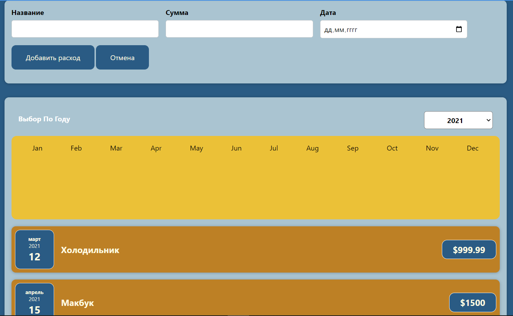

# React application for managing costs

### Features:
- You can add costs with dates
- Application calculates results
- It shows you the diagrams

### Technologies:
- Javascript language, 
- ReactJS library, 
- Html, Css

#### Demo link is available: [Try me!](http://costs-log.surkoff.su/)
